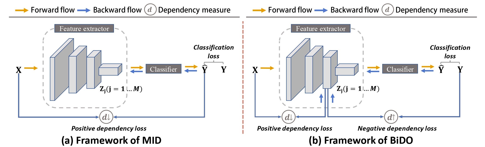

<h1 align="center">Bilateral Dependency Optimization: Defending Against Model-inversion Attacks</h1>
<p align="center">
    <a href="https://arxiv.org/pdf/2206.05483.pdf"></a>
    <a href="https://github.com/AlanPeng0897/Defend_MI"></a>
    <a href="https://dl.acm.org/doi/abs/10.1145/3534678.3539376">  </a>
</p>
<!-- label - message - color -->

Hi, this is the code for our KDD 2022 paper: *[Bilateral Dependency Optimization: Defending Against Model-inversion Attacks](https://arxiv.org/pdf/2206.05483.pdf)*.

Overview of MID framework vs. bilateral dependency optimization (BiDO) framework. BiDO forces DNNs to learn robust latent representations by minimizing $𝑑(𝑋,𝑍_j)$ to limit redundant information propagated from the inputs to the latent representations while maximizing $𝑑(𝑍_j,𝑌)$ to keep the latent representations informative enough of the label.

# Requiements
This code has been tested on Ubuntu 16.04/18.04, with Python 3.7, Pytorch 1.7 and CUDA 10.2/11.0

# Getting started
Download relevant datasets: CelebA, MNIST.
- [CelebA](http://mmlab.ie.cuhk.edu.hk/projects/CelebA.html)
- MNIST
    ```
    python prepare_data.py
    ```

The directory of datasets is organized as follows:
```
./attack_dataset
├── MNIST 
│   ├── *.txt 
│   └── Img
│       └── *.png
└── CelebA                            
    ├── *.txt 
    └── Img
        └── *.png
```

# Privacy enhancement with BiDO 
You can also skip to the next section for defending against MI attacks with well-trained defense models.
- For GMI and KED-MI
    ```
    # dataset:celeba, mnist, cifar; 
    # measure:COCO, HSIC; 
    # balancing hyper-parameters: tune them in train_HSIC.py
    python train_HSIC.py --measure=HSIC --dataset=celeba
    ```
    For KED-MI, if you trained a defense model yourself, you have to train an attack model (generative model) specific to this defense model.
    ```
    # put your hyper-parameters in k+1_gan_HSIC.py first
    python k+1_gan_HSIC --dataset=celeba --defense=HSIC
    ```
- For VMI  
    Please refer to this section (Defending against MI attacks - VMI - train with BiDO).
    


# Defending against MI attacks 
Here, we only provide the weights file of the well-trained defense models that achieve the best trade-off between model robustness and utility, which are highlighted in the experimental results.
- GMI
    - Weights file (defense model / eval model / GAN) :
        - Place [pretrained VGG16](https://1drv.ms/u/s!An_XOOYcXU0GggMxd_xImjJ1m1fk?e=VD8Dsp) in `BiDO/target_model/`
        - Place [defense model](https://1drv.ms/u/s!An_XOOYcXU0Gggb4NdzXqxrsa7vL?e=gOhPou) in `BiDO/target_model/celeba/HSIC/`
        - Place [evaluation classifer](https://1drv.ms/u/s!An_XOOYcXU0GgXwM2Nc_QrJqFLeM?e=0C88Ih) in `GMI/eval_model/`
        - Place [GAN](https://1drv.ms/u/s!An_XOOYcXU0GgWnu2qmbl3BZGHyT?e=6rz14z) in `GMI/result/models_celeba_gan/`

    - Launch attack
        ```
        # balancing hyper-parameters: (0.05, 0.5)
        python attack.py --dataset=celeba --defense=HSIC
        ```
    - Calculate FID
        ```
        # sample real images from training set
        cd attack_res/celeba/pytorch-fid && python private_domain.py 
        # calculate FID between fake and real images
        python fid_score.py ../celeba/trainset/ ../celeba/HSIC/all/
        ```
        
- KED-MI
    - Weights file (defense model / eval model / GAN) :
        - Place [defense model](https://1drv.ms/u/s!An_XOOYcXU0GggTyiELgboDjOa0y?e=OufV3X) in `BiDO/target_model/mnist/COCO/`
        - Place [evaluation classifer](https://1drv.ms/u/s!An_XOOYcXU0GgXqBElsXK0DQCKAD?e=07oQq4) in `DMI/eval_model/`
        - Place [improved GAN for celeba](https://1drv.ms/u/s!An_XOOYcXU0GgW4HgzYQCTBu7Coq?e=di6QmO) in `DMI/improvedGAN/celeba/HSIC/`
        - Place [improved GAN for mnist](https://1drv.ms/u/s!An_XOOYcXU0GgghNCBXxSHRX--Rq?e=CJeK1X) in `DMI/improvedGAN/mnist/COCO/`
    - Launch attack
        ```
        # balancing hyper-parameters: (0.05, 0.5)
        python recovery.py --dataset=celeba --defense=HSIC
        # balancing hyper-parameters: (1, 50)
        python recovery.py --dataset=mnist --defense=COCO
        ```
    - Calculate FID
        ```
        # celeba
        cd attack_res/celeba/pytorch-fid && python private_domain.py 
        python fid_score.py ../celeba/trainset/ ../celeba/HSIC/all/ --dataset=celeba
        # mnist
        cd attack_res/mnist/pytorch-fid && python private_domain.py 
        python fid_score.py ../mnist/trainset/ ../mnist/COCO/all/ --dataset=mnist
        ```

- VMI  
To run this code, you need ~38G of memory for data loading. The attacking of 20 identities takes ~20 hours on a TiTAN-V GPU (12G).
    - Data (CelebA)
        ```
        # create a link to CelebA
        cd VMI/data && ln -s ../../attack_data/CelebA/Img img_align_celeba
        python celeba.py
        ```
    - Weights file (defense model / eval model / GAN) :
        - Place [defense model](https://1drv.ms/u/s!An_XOOYcXU0GgX_ffiscTaShdhQT?e=3FbD2r) in `VMI/clf_results/celeba/hsic_0.1&2/`
        - Place [ir_se50.pth](https://1drv.ms/u/s!An_XOOYcXU0GggcLEgg4_yq0_y5l?e=lZyneT) in `VMI/3rd_party/InsightFace_Pytorch/work_space/save/`; Place [evaluation classifer](https://1drv.ms/u/s!An_XOOYcXU0GggA9oEsLocMnR-M5?e=8fsxFD) in `VMI/pretrained/eval_clf/celeba/`
        - Place [StyleGAN](https://1drv.ms/u/s!An_XOOYcXU0GggWTCCJV7CAhThpR?e=osrWUK) in `VMI/pretrained/stylegan/neurips2021-celeba-stylegan/`
    - Launch attack
        ```
        # balancing hyper-parameters: (0.1, 2)
        cd VMI
        # x.sh  (1st) path/to/attack_results (2nd) config_file  (3rd) batch_size
        ./run_scripts/neurips2021-celeba-stylegan-flow.sh  'hsic_0.1&2'  'hsic_0.1&2.yml' 32
        ```
    - Train with BiDO
        ```
        python classify_mnist.py --epochs=100 --dataset=celeba --output_dir=./clf_results/celeba/hsic_0.1&2 --model=ResNetClsH --measure=hsic --a1=0.1 --a2=2
        ```


# References
If you find this code helpful in your research, please consider citing
```bibtex
@inproceedings{peng2022BiDO,
title={Bilateral Dependency Optimization: Defending Against Model-inversion Attacks},
author={Peng, Xiong and Liu, Feng and Zhang, Jingfeng and Lan, Long and Ye, Junjie and Liu, Tongliang and Han, Bo},
booktitle={KDD},
year={2022}
}
```

# Implementation Credits
Some of our implementations rely on other repos. We want to thank the authors ([MID](https://arxiv.org/abs/2009.05241), [GMI](https://arxiv.org/abs/1911.07135), [KED-MI](https://arxiv.org/abs/2010.04092), [VMI](https://arxiv.org/abs/2201.10787)) for making their code publicly available.😄
